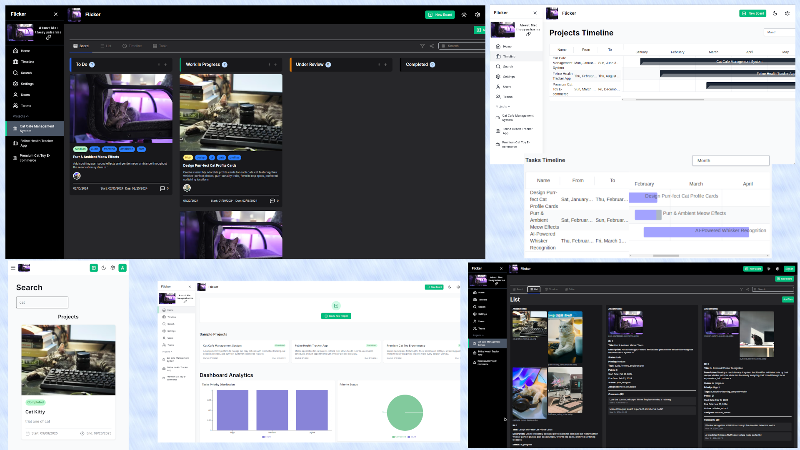

<p align="center">
    <h1>Flicker</h1>
</p>


A modern project management application built with Next.js and Go, featuring real time collaboration and intuitive task management.

<p align="center">
  <a href="https://flickercat.vercel.app">
    <h2> try it now </h2>
    
  </a>
</p>


```
flicker/
├── frontendNext/        # Next.js frontend application
│   ├── src/
│   │   ├── app/         # App router pages
│   │   ├── components/  # Reusable components
│   │   └── lib/         # Utilities and configurations
├── backendGo/           # Go backend application
│   ├── cmd/             # Application entry points
│   ├── internal/        # Internal packages
│   │   ├── handler/     # HTTP handlers
│   │   ├── models/      # Data models
│   │   └── routes/      # Route definitions
│   └── pkg/             # Public packages
└── README.md
```
